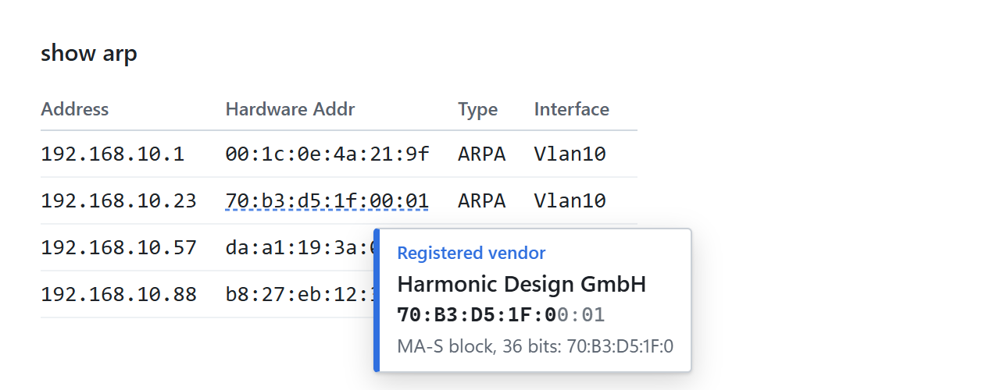
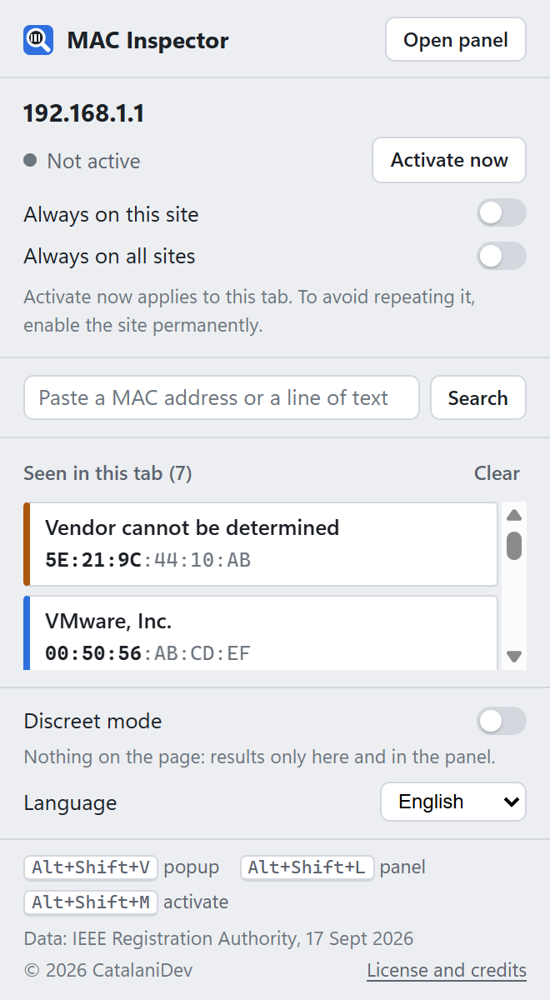
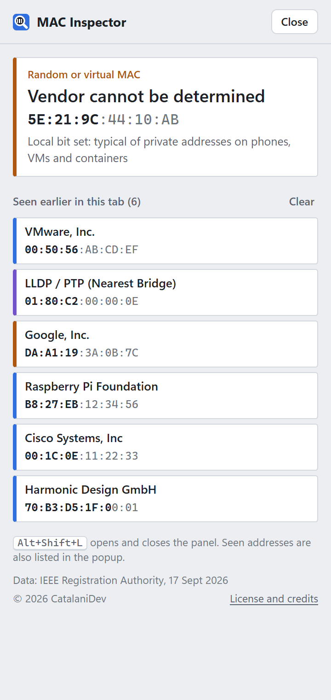

<p align="center">
  
</p>

<h1 align="center">MAC Inspector</h1>

<p align="center">
  <a href="README.md">English</a> · <strong>Italiano</strong>
</p>

<p align="center">
  <strong>Passa il cursore su un MAC address e scopri chi ha prodotto il dispositivo.</strong><br>
  Un'estensione per Google Chrome pensata per tabelle ARP, lease DHCP, console di switch e firewall, log e ticket.
</p>

<p align="center">
  
  
  
  
</p>



## Caratteristiche principali

- **Il produttore al passaggio del cursore.** Niente clic, niente copia e incolla. La parte dell'indirizzo che identifica il produttore è in grassetto.
- **Registro IEEE completo.** Blocchi MA-L, MA-M, MA-S, IAB e CID, con ricerca del prefisso più lungo: i blocchi piccoli risalgono al proprietario reale invece che a "IEEE Registration Authority".
- **Tipi di indirizzo a colori.**

  | Colore | Tipo di indirizzo |
  |---|---|
  | Blu | Produttore registrato |
  | Arancione | MAC casuale o virtuale (amministrato localmente) |
  | Viola | Indirizzo di gruppo o speciale |
  | Grigio | Non registrato |

- **Indirizzi speciali.** Broadcast, multicast IPv4 e IPv6, STP, LACP, LLDP, CDP, PVST+, VRRP e HSRP.
- **Notazioni riconosciute.**

  | Notazione | Esempio |
  |---|---|
  | Due punti | `00:1C:0E:11:22:33` |
  | Trattino | `00-1C-0E-11-22-33` |
  | Cisco | `001c.0e11.2233` |
  | Huawei / H3C | `001c-0e11-2233` |
  | HP / Aruba | `001c0e-112233` |
  | Senza separatori | `001C0E112233` |

- **Funziona** in testo semplice, tabelle, campi di testo e aree di testo, contenuti modificabili, SVG, web component e iframe.
- **Cronologia per scheda.** Gli indirizzi su cui passi il cursore compaiono nel popup e nel pannello laterale; un clic copia MAC e produttore.
- **Italiano e inglese.** La lingua si sceglie nel popup, oppure segue quella del browser.
- **Tema chiaro e scuro**, come Chrome.
- **Pagina About** con versione, copyright, licenza e crediti dei dati, che si apre dal collegamento "Licenza e crediti" nel popup e nel pannello laterale.

| Popup | Pannello laterale |
|---|---|
|  |  |

## Installazione

MAC Inspector non è pubblicata sul Chrome Web Store. Si installa da questo repository e richiede circa un minuto.

1. **Scarica.** Apri l'[ultima release](https://github.com/catalani-dev/mac-inspector/releases/latest) e scarica `mac-inspector-<versione>.zip` dalla sezione **Assets**. Contiene solo i file necessari all'estensione. Estrailo in una cartella definitiva, per esempio `Documenti\mac-inspector`: Chrome carica l'estensione da quella cartella a ogni avvio, quindi non va spostata né cancellata.

   In alternativa, includendo anche test, script di build e documentazione:
   - da questa pagina clicca su **Code → Download ZIP**, per lo stato attuale del ramo `main`;
   - oppure clona il repository con Git:

     ```bash
     git clone https://github.com/catalani-dev/mac-inspector.git
     ```

2. **Apri la pagina delle estensioni.** In Chrome scrivi `chrome://extensions` nella barra degli indirizzi e attiva la **Modalità sviluppatore** (in alto a destra).
3. **Carica l'estensione.** Clicca su **Carica estensione non pacchettizzata** e scegli la cartella che contiene `manifest.json`. Se hai estratto lo ZIP della release è la cartella `mac-inspector-<versione>`; con **Code → Download ZIP** è `mac-inspector-main`.
4. **Fissala nella barra.** Apri il menu delle estensioni (l'icona a forma di puzzle) e clicca sulla puntina accanto a MAC Inspector, così l'icona con la lente resta sempre visibile.

Richiede Chrome 120 o successivo. Gli altri browser basati su Chromium (Edge, Brave) di solito funzionano allo stesso modo, ma non sono stati provati.

**Aggiornamento.** Scarica lo ZIP della nuova release, sostituisci i file nella stessa cartella e clicca sulla freccia **Aggiorna** nella scheda di MAC Inspector in `chrome://extensions`. Le impostazioni restano.

**Rimozione.** Clicca su **Rimuovi** nella scheda di MAC Inspector in `chrome://extensions`, poi cancella la cartella.

## Come funziona

1. **Attivala dove ti serve.** Clicca sull'icona con la lente in una pagina che contiene MAC address (un router, la console di uno switch, un server DHCP, un visualizzatore di log) e scegli **Attiva ora** oppure **Attiva sempre su questo sito**.
2. **Passa il cursore su un MAC address.** L'indirizzo viene evidenziato e accanto al cursore compare una scheda:

   | Riga | Esempio |
   |---|---|
   | Tipo di indirizzo, con il colore | *Vendor registrato* |
   | Produttore | *Cisco Systems, Inc* |
   | L'indirizzo, con il prefisso del produttore in grassetto | ***00:1C:0E***:11:22:33 |
   | Blocco del registro corrispondente | *Blocco MA-L da 24 bit: 00:1C:0E* |

3. **Ritrovalo più tardi.** Ogni indirizzo visto finisce nell'elenco di quella scheda: l'icona nella barra mostra quanti sono, popup e pannello laterale li elencano e un clic copia MAC e produttore negli appunti.
4. **Cercane uno a mano.** Incolla un MAC address, o un'intera riga di testo che ne contiene uno, nel campo di ricerca del popup.

Non viene inviato niente a nessuno: la ricerca usa la copia del registro IEEE inclusa nell'estensione.

## Uso

Appena installata, MAC Inspector **non ha accesso a nessun sito**. Dal popup scegli dove attivarla:

| Opzione nel popup | Effetto |
|---|---|
| **Attiva ora** | Solo la scheda corrente, fino al ricaricamento della pagina. Nessuna richiesta di autorizzazione. |
| **Attiva sempre su questo sito** | Tutte le pagine di quel sito, per esempio `https://192.168.1.1`. Chrome chiede conferma. |
| **Attiva sempre su tutti i siti** | Ovunque. Chrome chiede conferma. |

Poi passa il cursore su un MAC address. Premi `Esc` per chiudere il tooltip.

### Scorciatoie da tastiera

| Scorciatoia | Azione |
|---|---|
| `Alt+Maiusc+V` | Apre il popup con gli indirizzi visti nella scheda |
| `Alt+Maiusc+M` | Attiva o disattiva MAC Inspector nella scheda corrente |
| `Alt+Maiusc+L` | Apre o chiude il pannello laterale |

Le scorciatoie si cambiano in `chrome://extensions/shortcuts`.

### Modalità discreta

La **modalità discreta** non aggiunge niente alla pagina: nessun tooltip e nessuna evidenziazione. I risultati compaiono solo nel popup, nel pannello laterale e nel contatore sull'icona.

### Lingua

Il menu **Lingua**, in fondo al popup, imposta tooltip, popup e pannello laterale in **italiano** o in **inglese**. Con **Automatica** segue la lingua del browser. La pagina About, che contiene licenza e note legali, è sempre in inglese.

Nome, descrizione e nomi delle scorciatoie mostrati in `chrome://extensions` seguono la lingua del browser, perché Chrome non permette alle estensioni di cambiarli.

### File locali

Per usare MAC Inspector nelle pagine `file://`, attiva **Consenti l'accesso agli URL dei file** nei dettagli dell'estensione.

## Privacy e sicurezza

- **Tutto avviene in locale.** Nessuna richiesta di rete, nessuna statistica, nessun servizio esterno. Il registro IEEE è incluso nell'estensione.
- **La pagina non viene mai riscritta.** Moduli, contenuti modificabili e applicazioni web restano intatti.
- **I campi password** non vengono mai letti.
- **La cronologia** resta solo nella memoria del browser. Si cancella alla chiusura della scheda o del browser e si può svuotare in qualsiasi momento.
- **Autorizzazioni:**
  - `activeTab`, `scripting`: attivazione nella scheda che scegli tu;
  - `storage`: impostazioni e cronologia;
  - `sidePanel`: il pannello laterale.

  L'accesso ai siti è facoltativo e viene concesso sito per sito.
- **Content Security Policy restrittiva** in tutte le pagine dell'estensione: possono essere caricati solo script, stili, immagini e file dell'estensione stessa; codice inline, risorse remote e inclusione in frame sono bloccati.
- **Nessun codice remoto.** Il registro è solo dati JSON e tutti i testi, compresi i nomi dei produttori, vengono inseriti come testo e mai interpretati come HTML.
- **I messaggi sono controllati.** Il service worker accetta messaggi solo dall'estensione stessa e verifica ogni campo.

## Aggiornare il registro IEEE

`oui-data.json` si rigenera con lo script incluso (Python 3.8 o successivo, senza pacchetti di terze parti):

```bash
python build-oui-database.py
```

Lo script scarica i registri IEEE e ne verifica struttura e numero di voci:

- se il registro principale MA-L non si scarica o risulta anomalo, il database esistente non viene toccato;
- se fallisce un registro secondario, le sue voci vengono riprese dal file precedente;
- il file viene sostituito in un'unica operazione, quindi non resta mai scritto a metà.

Per controllare il file attuale senza scaricare niente:

```bash
python build-oui-database.py --check
```

Dopo un aggiornamento clicca su **Aggiorna** nella scheda dell'estensione in `chrome://extensions`.

## Sviluppo

Per eseguire i test servono Node.js 18 o successivo e Python 3.8 o successivo:

```bash
node --test tests/mac-core.test.js
python -B -m unittest discover -s tests
```

L'opzione `-B` evita che Python crei le cartelle `__pycache__`: Chrome si rifiuta di caricare una cartella di estensione che contiene file o cartelle il cui nome inizia con `_`, a parte `_locales`.

| File | Scopo |
|---|---|
| `manifest.json` | Configurazione dell'estensione (Manifest V3) |
| `mac-core.js` | Riconoscimento dei MAC, ricerca nel registro, indirizzi speciali, testi mostrati |
| `content.js` | Rilevamento del passaggio del cursore, evidenziazione e tooltip nelle pagine web |
| `background.js` | Service worker: registro, accesso ai siti, cronologia, pannello laterale, scorciatoie |
| `i18n.js` | Testi dell'interfaccia in italiano e inglese, impostazione della lingua |
| `_locales/` | Nome, descrizione e nomi delle scorciatoie per `chrome://extensions` |
| `popup.html`, `popup.css`, `popup.js` | Popup della barra degli strumenti |
| `panel.html`, `panel.css`, `panel.js` | Pannello laterale |
| `about.html`, `about.css`, `about.js` | Pagina About: versione, copyright, licenza, note di terze parti |
| `ui.css`, `ui.js` | Stili e componenti condivisi da popup, pannello laterale e pagina About |
| `build-oui-database.py` | Genera `oui-data.json` dai registri IEEE |
| `oui-data.json` | Dati del registro IEEE (dati di terze parti, vedere [NOTICE.md](NOTICE.md)) |
| `icons/` | Logo (`logo.svg` e `logo-small.svg` per i 16 px) e le icone PNG generate da questi |
| `tests/` | Test automatici |
| `docs/img/` | Schermate e immagine di anteprima usate su GitHub |

Ogni file sorgente inizia con un'intestazione [SPDX](https://spdx.dev/) che indica il titolare del copyright e la licenza.

## Licenza

Copyright (c) 2026 CatalaniDev. Distribuito con la **MAC Inspector License 1.0**. È una licenza a sorgente visibile, non una licenza open source. Il testo completo è in [LICENSE](LICENSE), in inglese, che è la versione che fa fede. Questa sintesi in italiano serve solo a orientarsi.

| | |
|---|---|
| **Consentito** | Leggere il codice; usare MAC Inspector per sé o all'interno della propria organizzazione, anche al lavoro; modificarlo per uso proprio. |
| **Consentito con crediti** | Includere MAC Inspector, modificato o no, in un proprio strumento **gratuito e non commerciale**, purché quello strumento aggiunga funzionalità sostanziali e i crediti vengano mantenuti (vedi sotto). |
| **Richiede autorizzazione scritta** | Includere MAC Inspector in un prodotto o servizio **commerciale** (a pagamento, in abbonamento, con versioni a pagamento, servizi online a pagamento, in pacchetto con offerte a pagamento o finanziati dalla pubblicità); ridistribuirlo da solo; pubblicarlo o pubblicarne una copia su uno store di estensioni; venderlo da solo; rimuovere le indicazioni di copyright. |

### Includere MAC Inspector nel proprio strumento

**Prodotti commerciali.** Se il tuo prodotto o servizio genera guadagno in qualunque forma, scrivi a <catalanidev@gmail.com> prima di includere MAC Inspector. L'autorizzazione viene valutata caso per caso.

**Strumenti gratuiti e non commerciali.** Segui questi passi:

1. Mantieni l'intestazione SPDX in ogni file che riutilizzi.
2. Distribuisci una copia di [LICENSE](LICENSE) oppure un collegamento al file.
3. Inserisci i crediti nella documentazione e nella sezione "Informazioni" o "Crediti":

   ```text
   Includes MAC Inspector, Copyright (c) 2026 CatalaniDev,
   used under the MAC Inspector License 1.0.
   ```

4. Dichiara se hai modificato il codice.
5. Non chiamare il tuo strumento "MAC Inspector" e non lasciare intendere che sia approvato dall'autore.
6. Se riutilizzi il popup, il pannello laterale o la pagina About, lascia visibili la riga "© 2026 CatalaniDev" e il collegamento "Licenza e crediti".

I dati del registro IEEE e i marchi citati appartengono ai rispettivi proprietari e non sono coperti da questa licenza: vedere [NOTICE.md](NOTICE.md). MAC Inspector non è affiliata a IEEE o Google, né da loro approvata.

## Autore

**CatalaniDev**, <catalanidev@gmail.com>

Per autorizzazioni non previste dalla licenza, commenti o segnalazioni di problemi, scrivi all'indirizzo qui sopra.
